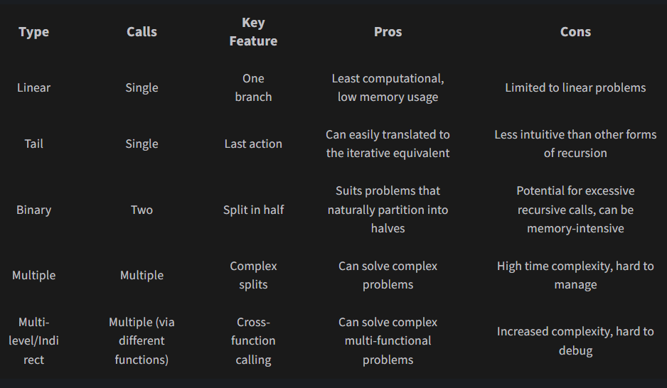
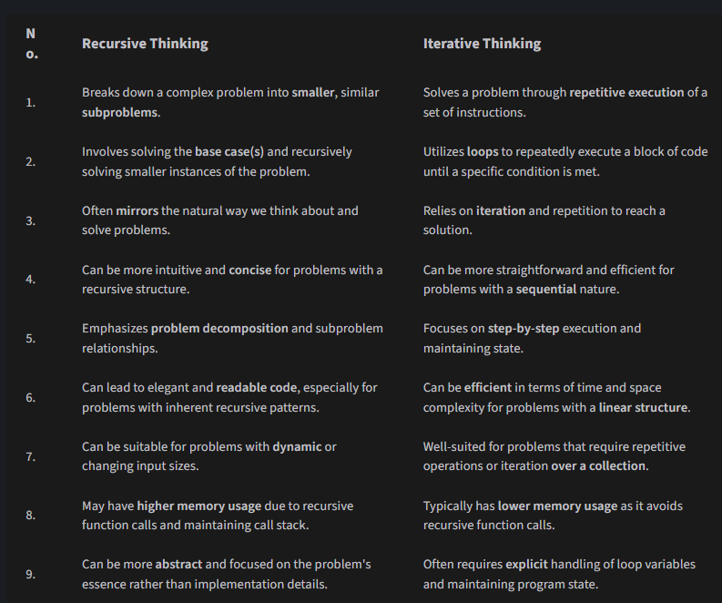

# DSA Concepts List

## Arrays

- Basics
- **Two Pointers**
- Sliding Window

## Stack

Stack is a linear data structure that operates on the principle of Last-In, First-Out (LIFO),
meaning the most recently added element is the first one to be removed.

- Operations:
    - **Push**: Add an element to the top of the stack 0(1)
    - **Pop**: Remove an element from the top of the stack 0(1)
    - **Peek**: Get the top element of the stack 0(1)
    - **isEmpty**: Check if the stack is empty 0(1)
    - **isFull**: Check if the stack is full 0(1)
    - **Size**: Get the number of elements in the stack 0(1)
    - **Search**: Search for an element in the stack 0(n)
    - **Clear**: Remove all elements from the stack 0(n)
- Implementing Stack using:
    - **Array**
    - **Linked List**
- Applications:
    - Memory management
    - Expression evaluation
    - Function calls
    - Undo mechanisms
    - Backtracking
    - Depth First Search (DFS)
    - web pages history in browsers

## Queue

Queue is a linear data structure that operates on the principle of First-In, First-Out (FIFO),meaning the earliest
added element is the first one to be removed.

- Types
    - **Simple queue**
    - **Deque (Double ended queue)**: elements can be added or removed from both ends of the Queue. Think about a
      library line where you can borrow books from one end and return books at the other end.
    - **Circular queue**: A circular queue is a linear data structure where the last position is connected back to the
      first, forming a circle. It efficiently utilizes space by reusing positions when elements are dequeued.
    - **Priority queue**: A priority queue is a data structure where each element has a priority, and elements with
      higher priority are dequeued before elements with lower priority. It can be implemented using heaps for efficient
      access to the highest (or lowest) priority element.
    - **Affinity queue**: every element has an affinity & is placed with an element having the same affinity; otherwise
      placed at the rear
- Operations:
    - **Enqueue:** 0(1)
    - **Dequeue:** 0(1)
    - **Front:** 0(1)
    - **isEmpty:** 0(1)
- Implementing Stack using:
    - **Array**
    - **Linked List**
    - **Two stack**
- Applications:
    - CPU scheduling
    - Task scheduling
    - Breadth first search
    - Messaging Systems – Used in asynchronous communication (e.g., Kafka, RabbitMQ, message queues)
    - Caching
    - Printers
    - Call center

## Recursion

Recursion is a method of solving a problem by having a function call itself.

- Recursion Elements
    - Base case: The base case is the condition under which the function stops making further recursive calls.
    - Recursive case: Always begin by identifying the base case while designing a recursive function. It's the
      cornerstone that prevents infinite recursion.
    - Function prologue and epilogue: The prologue consists of the operations we perform before issuing a new recursive
      call, and the epilogue includes the operations we
      perform after the recursive call. Be mindful of the operations in the prologue and epilogue. Their order can
      significantly affect the function's behavior.
- A call stack is a mechanism that keeps track of function calls in a program. It's an important part of recursion
  because it helps keep track of where the program should return to after a function call is completed.
- Types
    - Linear recursion refers to a scenario where a function makes a single recursive call to itself. It is also known
      as single recursion. Factorial computation, array summation, linkedlist traversal, checking panlindrome and
      finding maximum in array are common examples.
    - Tail recursion is a subtype of linear recursion where the recursive call is the last operation in the function. In
      other words, a function with tail recursion has an empty epilogue.
    - A function exhibits binary recursion when it makes two recursive calls to itself. It is as if the function splits
      into two at each level, thus the name binary recursion. Merge sort, quick sort, binary tree traversal, height of
      binary tree, maximal subarray sum, closet pair of points and tower of Hanoi are common examples.
    - Multiple recursion, sometimes known as "multi-way recursion," is a technique where a function
      makes more than two recursive calls. This tactic typically applies to more complex problems that need to be
      broken down into a larger number of simpler, similar problems. Sierpinski triangle, Fractal tree and flood fill
      algorithm are common examples.
    - 
- Iteration vs Recursion 
    - every recursive solution has an iterative equivalent
    - When Is Iteration Preferred Over Recursion?
        - Efficiency: Recursion can lead to stack overflow if the recursion depth is too large.
        - Memory Usage: Iterative solutions often use less memory than recursive ones (except when an explicit stack is
          required).
        - Performance: Function calls add overhead, so iteration is usually faster.
    - When Is Recursion Preferred?
        - Readability: Some problems (like tree traversal, backtracking, and divide-and-conquer algorithms) are more
          naturally expressed using recursion.
        - Built-in Optimization: Some languages (like functional programming languages) optimize tail-recursive
          functions automatically.
- Recursive Algorithm strategies
    - Divide and conquer: The divide & conquer strategy is a recursive algorithm design technique that involves breaking
      down a problem into smaller subproblems, solving each subproblem independently, and combining the solutions to
      obtain the final result. The divide & conquer is suitable for problems that exhibit overlapping subproblems and
      can be efficiently solved by combining the solutions of smaller instances.
        - Divide: Break the original problem into smaller, more manageable subproblems. This step can often be
          represented
          by recursively calling the same algorithm on the subproblems.
        - Conquer: Solve the subproblems independently. If the subproblems are small enough, they can be solved directly
          using a base case or a simple algorithm.
        - Combine: Combine the subproblems' solutions to obtain the final solution to the original problem. This step
          may
          involve merging or aggregating the subproblem solutions or applying additional operations to obtain the
          desired result.
    - Dynamic programing
        - Dynamic programming is a technique used to solve complex problems by breaking them down into overlapping
          subproblems and solving each subproblem only once. It is often used to optimize recursive algorithms by
          storing and reusing the results of subproblems.
        -
- Complexity Analysis